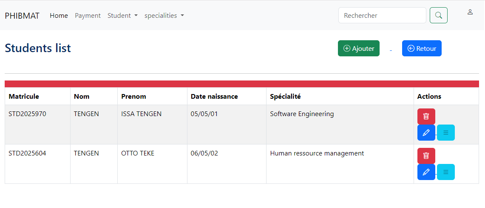
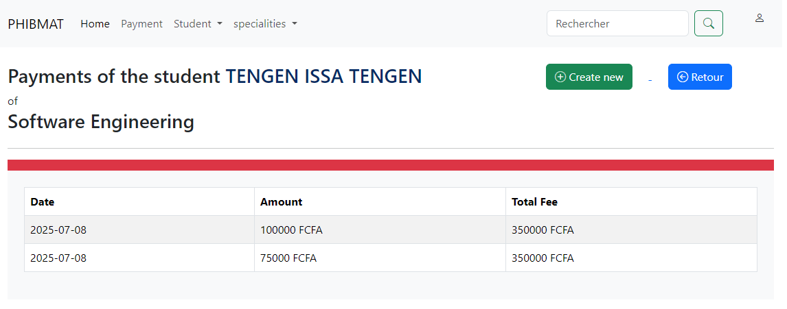

# School Application

This is a Symfony-based web application for managing students, specialities, and payments in a school environment.

## Features

- List, add, and manage students and their specialities
- 
- Record and view student payments
- 
- Display students with unpaid fees
- 
- User-friendly web interface

## Requirements

- PHP 8.1 or higher
- Composer
- MySQL
- Node.js and npm (for asset building)
- Git

## Installation

1. **Clone the repository from GitHub**

   ```sh
   git clone # School Application

This is a Symfony-based web application for managing students, specialities, and payments in a school environment.

## Features

- List, add, and manage students and their specialities
- Record and view student payments
- Display students with unpaid fees
- User-friendly web interface

## Requirements

- PHP 8.1 or higher
- Composer
- MySQL
- Node.js and npm (for asset building)
- Git

## Installation

1. **Clone the repository from GitHub**

   ```sh
   git clone git@github.com:issatengen/schoolFees.git
   cd schoolFees